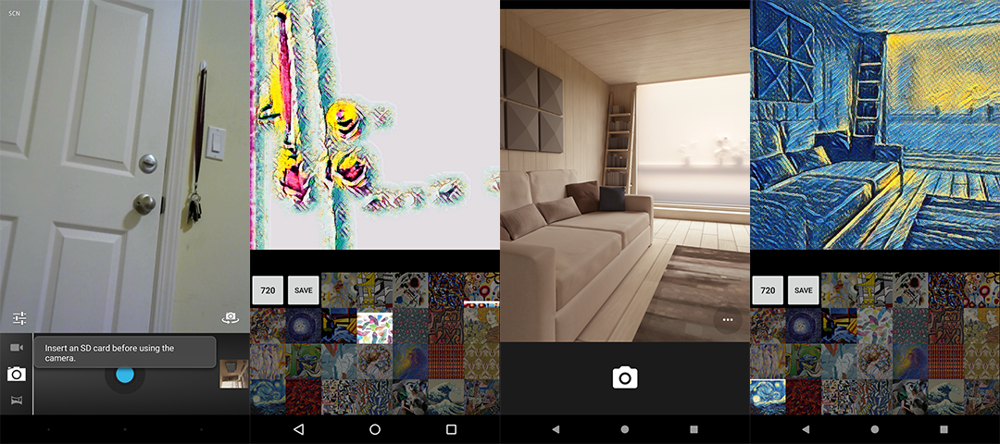

# Artistic Style Transfer in Android using TensorFlow

This repository supports the codelab for [Artistic Style Transfer in Android using TensorFlow](https://codelabs.developers.google.com/codelabs/tensorflow-style-transfer-android/). It
is based on code forked from the [TensorFlow](https://github.com/tensorflow/tensorflow) repository.

This is a forked repository from Google coodlab for my Android development study.

## Notes

Note 1: For these lines added to `biuld.gradle`, change the "compile" to "implementation".
Otherwise the current version (3.1) Android Studio will generate warning to change it.
Seems "compile" will be removed by the end of 2018.

```gradle
dependencies {
   compile 'org.tensorflow:tensorflow-android:1.2.0-preview'
}
```

Note 2: To correctly use `TensorFlowInferenceInterface`, remember to add this line to the import part.
The IDE may or may not add it automatically.

```java
import org.tensorflow.contrib.android.TensorFlowInferenceInterface;
```

## Running test

This is my running tests (left: API 21, right: API 27).



## Useful references

<https://magenta.tensorflow.org/2016/11/01/multistyle-pastiche-generator/>

<https://research.googleblog.com/2016/10/supercharging-style-transfer.html>
